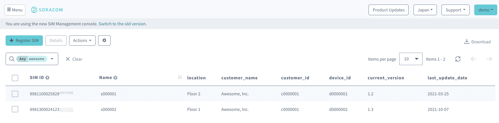
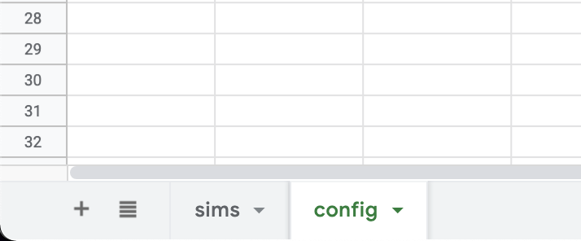
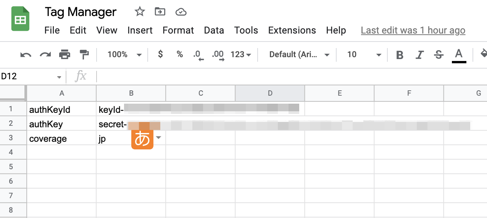

# Soracom Air Tag Manager
Soracom Air Tag Manager is an Apps Script for adding / updating Soracom Air tags with Google Sheets.

Soracom Air has a tag function that assigns arbitrary information with key value, but it is necessary to use the Soracom API to manage a lot of SIM tag information, and there are also challenge in managing tag information. (As of January 2022). The scripts in this repository manage the tag master data in Google Sheets and provide Apps Script to be applied to Soracom's Web Console in a batch.

## How to use

### 1. Create Google Sheets

[Example sheet](https://docs.google.com/spreadsheets/d/1t5vxhR37fR5Ql32tR5fZz0182zCxfEX8GJmTgS_sv4k/edit?usp=sharing)

Create Google Sheets that will be the master data for your tags.
Create two sheets, the first is the sims sheet with the tag master data, and the second is the config sheet with the Soracom connection information.

In the sims sheet, the first row is a list of tag keys, the first column is the SIM ID showing the unique ID of the SIM, the remaining columns are the tag keys, and the parameters are entered in the following rows.
Enter the API access information in the config sheet as shown in the example.

If you want to use existing data as master data, please use the CSV export feature of SIM list information.

- Reference (JP only): https://blog.soracom.com/ja-jp/2021/04/28/csv-export-list-of-sim-feature/

### 2. Configure API credentials

Issue the credential apiKeyID (AuthKeyId) and apiKey (AuthKey Secret) for API access and enter them in the config sheet together with coverage.

Credentials require `Sim:putSimTags` permissions.

- Reference (JP): https://users.soracom.io/ja-jp/docs/sam/create-sam-user/#%E8%AA%8D%E8%A8%BC%E3%82%AD%E3%83%BC%E3%81%AE%E7%94%9F%E6%88%90
- Reference (EN): https://developers.soracom.io/en/docs/security/users-and-roles/#enabling-authkeys-authentication

### 3. Configure and run script
Add the Apps Script to your spreadsheet and run it.

Delete the default script and add the two gs files contained in the repository.

Click Run after adding the file.
Make sure the tag information is updated in the web console.