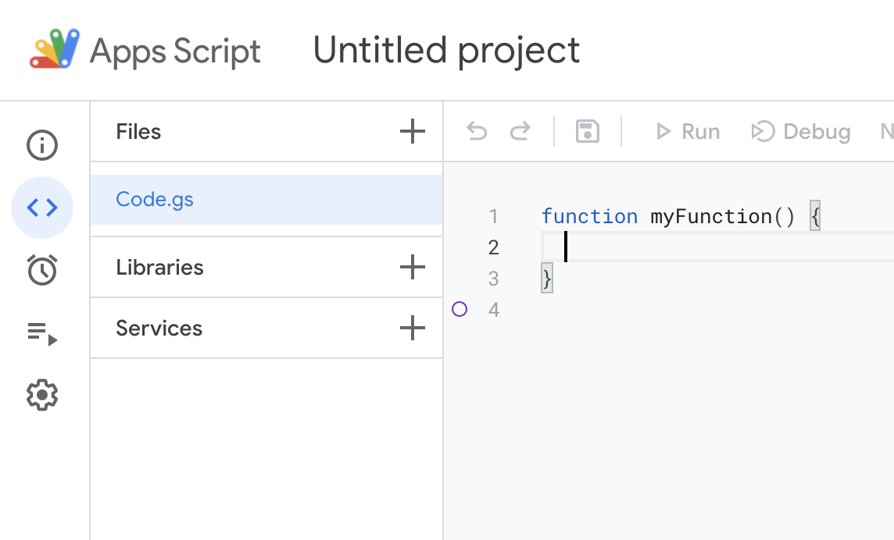

# SORACOM Air Tag Manager
SORACOM Air Tag Manager は、 Google Sheets で SORACOM Air タグを追加/更新するための Apps Script です。

SORACOM Air にはキーバリューで任意の情報を割り当てるタグ機能がありますが、多くのSIMタグ情報を管理するには SORACOM API を使用する必要があり、タグ情報の管理には一手間かけないといけません（2022年1月現在）。このリポジトリのスクリプトは、Google Sheets でタグのマスターデータを管理し、タグを SORACOM のWebコンソールにまとめて適用する Apps Script を提供します。

## 使い方

### 1. Google Sheets を作成する

[サンプルシート](https://docs.google.com/spreadsheets/d/1t5vxhR37fR5Ql32tR5fZz0182zCxfEX8GJmTgS_sv4k/edit?usp=sharing)

タグのマスターデータとなる Google Sheets を作成します。
Sheetsには2枚のシートを作成します。1枚目はタグマスターデータを含む `sims` シートで、2枚目は SORACOM 接続情報を含む `config` シートです。

`sims` シートでは、最初の行はタグキーのリストです。最初の列はSIMの一意のIDを示すSIM IDで残りの列はタグキーとなり、タグパラメーターは続く行に入力されます。
`config` シートには次のAPIクレデンシャルの設定例で示すように、APIアクセス情報を入力します。

なお、既存の設定済タグデータをマスタデータとして使用する場合は、SIMリスト情報のCSVエクスポート機能を使用してください。

- リファレンス (JP only): https://blog.soracom.com/ja-jp/2021/04/28/csv-export-list-of-sim-feature/

### 2. APIクレデンシャルの設定

APIアクセス用のクレデンシャルapiKeyID（AuthKeyId）とapiKey（AuthKey Secret）を発行し、カバレッジ(`g` or `jp`)と一緒に `config` に入力します。

クレデンシャルには `Sim：putSimTags` 権限が必要です。予め設定を済ませておきましょう。

- リファレンス (JP): https://users.soracom.io/ja-jp/docs/sam/create-sam-user/#%E8%AA%8D%E8%A8%BC%E3%82%AD%E3%83%BC%E3%81%AE%E7%94%9F%E6%88%90
- リファレンス (EN): https://developers.soracom.io/en/docs/security/users-and-roles/#enabling-authkeys-authentication

### 3. スクリプトを設定して実行します
Apps Script を Google Sheets に追加して実行します。

デフォルトのスクリプトを削除し、リポジトリに含まれている2つのgsファイルを追加します。

ファイルを追加したら、Run をクリックします。
タグ情報がWebコンソールで更新されていることを確認してください。